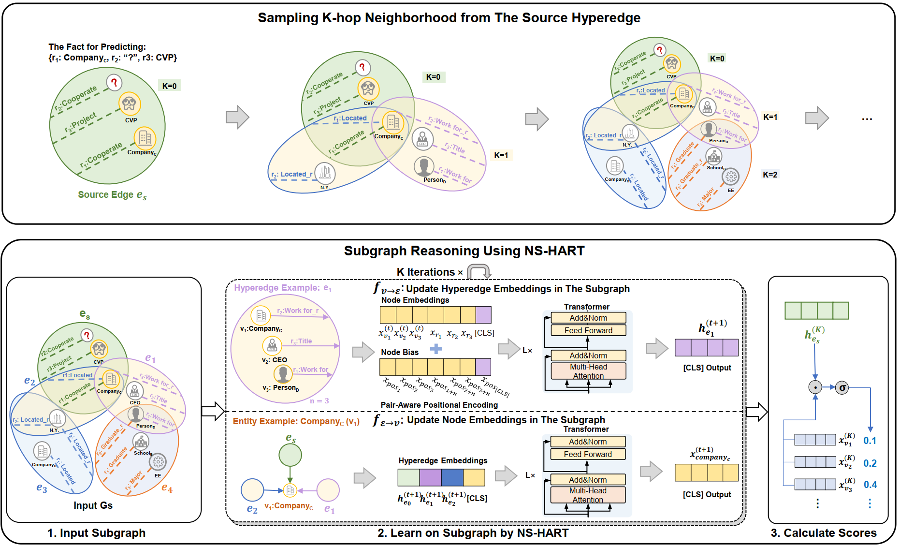

# Inductive Link Prediction on N-ary Relational Facts via Semantic Hypergraph Reasoning


<p align="center">
<a href="https://github.com/Nary-Inductive-SubGraph/blob/master/LICENSE">
</a>
<a href="https://guiltless-chalk-a57.notion.site/Inductive-Link-Prediction-on-N-ary-Relational-Facts-via-Semantic-Hypergraph-Reasoning-17ac80b1bb69802cb834d2d9457a426d?pvs=4"></a>
<a href="https://wandb.ai/catyin/Nary-Inductive-SubG/reports/Report--VmlldzoxMDkxMjcyNw?accessToken=2n7v6x8o328w3oq45toq5d5fe60tmdgonng1xdmn0dii7jqek6ixkx3jm1jcfe54">
</a>
<a href="https://figshare.com/s/b97b50ffa6bd8e5a054c"></a>
<a href="https://doi.org/10.5281/zenodo.14637435"></a>
<a href=""></a>
</p>

The official codes for paper "Inductive Link Prediction on N-ary Relational Facts via Semantic Hypergraph Reasoning" [KDD'25, V.1]. 

## Overview of the proposed NS-HART
  

Based on the assumption that extended neighboring subgraphs of
the source entities (i.e. known entities in the incomplete fact
being predicted) contain inference clues for inductive link prediction, we aim to develop an effective solution tailored for n-ary relational KGs via subgraph reasoning. 

First,
we samle K-hop neighborhoods from the source entities. 
Then, we introduce
n-ary subgraph aggregating networks to learn from the sampled
subgraph, deriving node and hyperedge embeddings enriched with
neighborhood contexts. Finally, link prediction is achieved
by calculating scores between the updated embeddings of the source
hyperedge and the potential candidate entities. 
Please refer to the paper for details.


## Installing Dependencies

- Dependencies can be installed using `requirements.txt`.
- Follow the Guide to install flash-attention: https://github.com/Dao-AILab/flash-attention

## Preparation

- Make directories: `./checkpoints`
- Configure wandb in `run.py`, set `wandb.login(key="")` to your wandb key. ( This step is optional, you can also set use_wandb == False)
- Download datasets from <a href="https://figshare.com/s/b97b50ffa6bd8e5a054c"></a>, put them in  `../data/nary` directory.


## Training and Evaluating

- Parameters for reproducing the reported results of HART are saved in `./config`. 
- You can find the official reproduce reports using wandb [here](https://wandb.ai/catyin/Nary-Inductive-SubG/reports/Report--VmlldzoxMDkxMjcyNw?accessToken=2n7v6x8o328w3oq45toq5d5fe60tmdgonng1xdmn0dii7jqek6ixkx3jm1jcfe54).

### Training and Evaluating
#### Task: TR-EF
```shell
# WD20K (100) V1
python run.py -config_file True -dataset "FI_WD20K100" -version "v1" -task "TR-EF"
  
# WD20K (66) V1
python run.py -config_file True -dataset "FI_WD20K66" -version "v1" -task "TR-EF"
  
# WD20K (100) V2
python run.py -config_file True -dataset "FI_WD20K100" -version "v1" -task "TR-EF"

# WD20K (66) V2
python run.py -config_file True -dataset "FI_WD20K66" -version "v2" -task "TR-EF"
```
#### Task: TR-NEF
```shell
# WD20K (100) V1
python run.py -config_file True -dataset "FI_WD20K100" -version "v1" -task "TR-NEF"
  
# WD20K (66) V1
python run.py -config_file True -dataset "FI_WD20K66" -version "v1" -task "TR-NEF"
  
# FI-MFB (100)
python run.py -config_file True -dataset "FI_MFB15K100" -task "TR-NEF"

# FI-MFB (33)
python run.py -config_file True -dataset "FI_MFB15K33" -task "TR-NEF"
```
#### Task: PSR
```shell
# WD20K (100) V1
python run.py -config_file True -dataset "FI_WD20K100" -version "v1" -task "PSR"
  
# WD20K (66) V1
python run.py -config_file True -dataset "FI_WD20K66" -version "v1" -task "PSR"
  
# FI-MFB (100)
python run.py -config_file True -dataset "FI_MFB15K100" -task "PSR"

# FI-MFB (33)
python run.py -config_file True -dataset "FI_MFB15K33" -task "PSR"
```

### Ablation Study (TR-EF as an example)

```shell
# w/o message passing
python run.py -config_file True -dataset "FI_WD20K100" -version "v1" -model_name "SubgTrans" -task "TR-EF"

# w/o high-order relations
python run.py -config_file True -dataset "FI_WD20K100" -version "v1" -model_name "HART" -binary True -task "TR-EF"

# HART (intra-edge)
python run.py -config_file True -dataset "FI_WD20K100" -version "v1" -model_name "HART-Intra"  -task "TR-EF"

```

### Reproduce Other Baselines

```shell
# eg.QBLP
python run.py -dataset "FI_WD20K100" -version "v1" -model_name "QBLP"  -task "TR-EF"
# eg.UniSAGE
python run.py -dataset "FI_WD20K100" -version "v1" -model_name "HyperAggModel" -hagg_method "sage" -task "TR-EF"
```


#### If you find this work helpful, please kindly cite:

```
@inproceedings{NS-HART,
  title={Inductive Link Prediction on N-ary Relational Facts via Semantic
Hypergraph Reasoning},
  author={Yin, Gongzhu and Zhang, Hongli and Yang, Yuchen and Luo, Yi},
  booktitle={KDD},
  year={2025}
}
```

For any further questions, feel free to contact:  ```yingz@hit.edu.cn```
